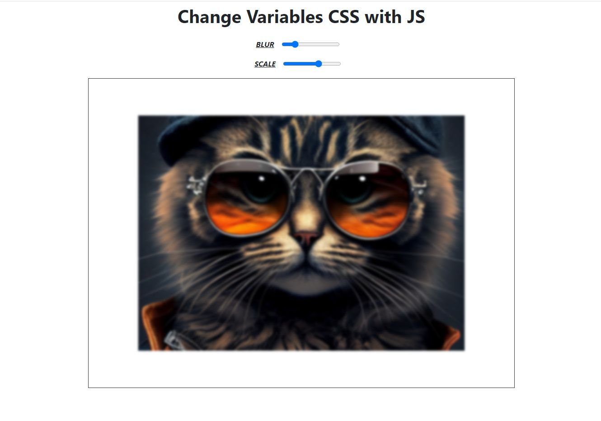

# Change Variables CSS with JavaSript

This project is my solution of the Java Script Course and it's focusing on practice dynamically menagment attributes properties with use CSS Variables. In this case I use events on input range to updating image scale and blur.

# The challenge

Users should be able to:

- Create simple view-page,
- Write a script to handle values CSS attributes properties using input range.

# Link

- Live Site URL: <a class="d-inline-block mx-2" href="https://marcinmierzwa.github.io/Change-Variables-CSS-with-JS/"> Change Variables CSS with JavaSript
  </a>

# Built with

- HTML5
- CSS3
- Bootstrap
- JavaScript
